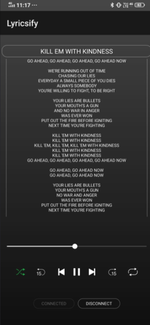
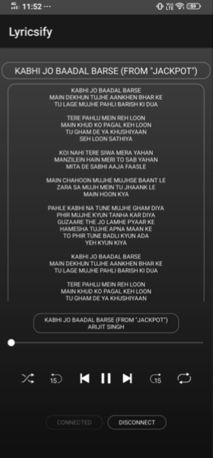

# Lyricsify
Play songs on spotify with lyrics

# Steps to follow
1. If you haven't downloaded spotify in your phone, then, please do and create an account
2. open app-debug.apk in your android phone and install the app.
3. Press connect to integrate your spotify account.
4. Enjoy singing with correct lyrics.

       

